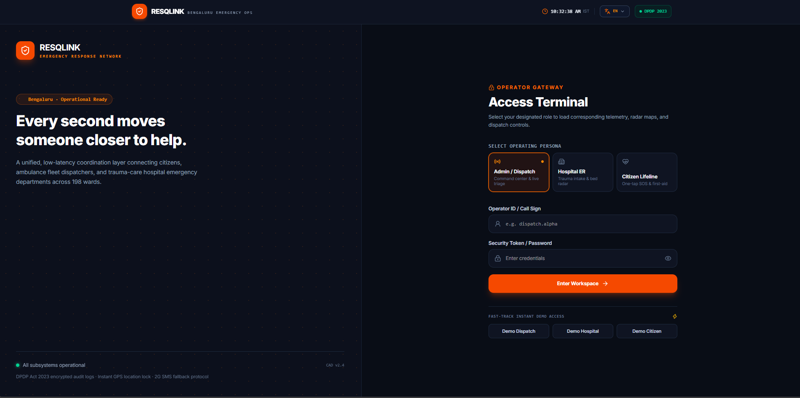
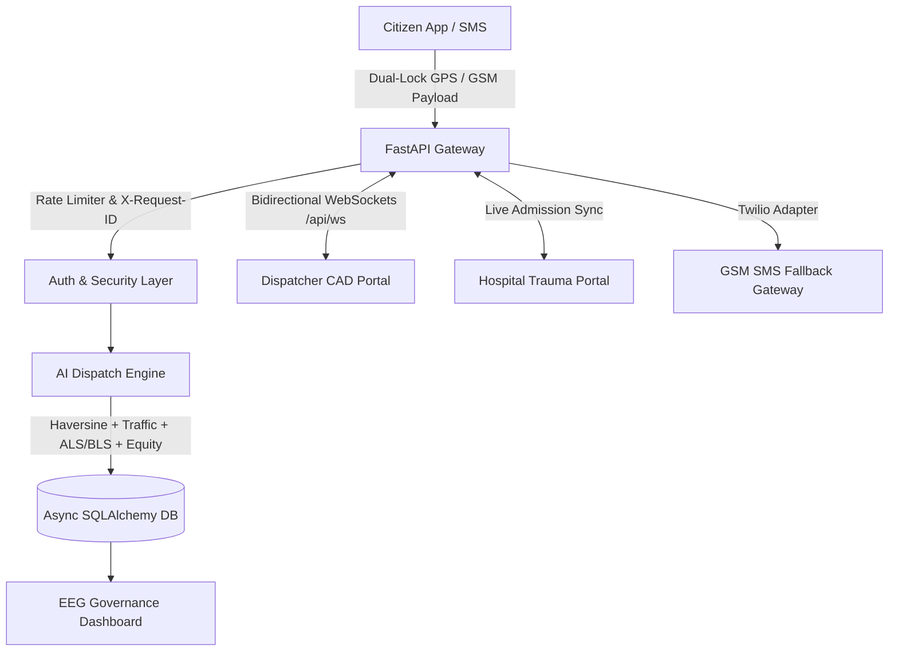

# RESQLINK: AI-Powered Citizen-Centric Emergency Assistance and Dispatch System

<div align="center">


<br/>

**Evaluating Equity, Efficacy, and Governance in Urban Emergency Response**  
*Department of Computer Science and Business Systems*  
*K S School of Engineering and Management (KSSEM), Bengaluru, India*  

Aligned with **UN SDG 3: Good Health and Well-being** and **UN SDG 11: Sustainable Cities and Communities**

<br/>



*Tactical command center dashboard featuring real-time GIS fleet tracking, multi-portal triage, and live emergency telemetry.*

</div>

---

## Overview

**RESQLINK** is an AI-powered emergency assistance and dispatch system designed to address systemic delays and geographic disparities in urban emergency response, with an operational benchmark in **Bengaluru, India**.

The platform enables citizens to trigger emergency requests through an ultra-accessible, single-tap interface designed for elderly individuals, differently-abled persons, and low digital-literacy users. RESQLINK integrates:
- **Dual-reading temporal GPS verification** to eliminate false triggers.
- **Multi-factor AI dispatch** considering ALS/BLS capabilities, live traffic, and peripheral ward equity.
- **Real-time WebSockets and Leaflet CAD monitoring** for emergency dispatchers and hospital trauma centers.
- **GSM/2G SMS fallback** with 160-character compressed payloads for zero-broadband resilience.
- **Cryptographically auditable governance ledger** aligned with India's DPDP Act, 2023.

---

## System Architecture and Capabilities



### 1. Client Application Layer
- **One-Tap SOS Activation**: Instant trigger with audio-haptic feedback.
- **High-Contrast Accessibility Mode**: WCAG AAA compliant styling.
- **Voice Assistance and Text-to-Speech**: Hands-free guidance.
- **Multilingual Localization**: English, Kannada (ಕನ್ನಡ), and Hindi (हिन्दी).
- **Responsive Mobile-First PWA**: Zero latency on low-end mobile browsers.

### 2. Location-Lock Safety Protocol
- Implements a dual-reading temporal GPS verification algorithm.
- Validates consecutive coordinates within **≤ 25 metres** over a timed window.
- Distinguishes genuine panic triggers from pocket dials and GPS signal drift.

### 3. AI-Assisted Dispatch Engine
Evaluates live operational vectors to compute optimal responder allocation:
- **Proximity**: Haversine distance to incident epicenter.
- **Care Capability**: Advanced Life Support (ALS) vs. Basic Life Support (BLS) matching.
- **Hospital Capability**: Trauma-care capacity and ICU bed availability.
- **Live Traffic Factor**: Congestion multipliers for Bengaluru arterial corridors.
- **Peripheral Ward Equity Bonus**: Counteracts central-zone bias for underserved outer wards.

### 4. Dispatcher CAD and Hospital Portals
- **Real-Time Incident Queues**: Filtered by triage priority (Critical, Moderate, Minor).
- **Live Leaflet Fleet Tracking**: Dynamic route polylines, speed, and ETA calculations.
- **Hospital Bed Allocation**: Direct pre-hospital notification for incoming trauma admissions.
- **Real-time WebSocket Broadcasts**: Instant state sync across all active portals without polling.

### 5. Low-Connectivity SMS Fallback
When broadband or 4G/5G data is unavailable, RESQLINK triggers a GSM SMS payload compressed into standard 160-character format:
```text
RESQ#ID#LOC#ACC#TYPE#USR#TIME
```
Decoded server-side and routed directly into the CAD incident queue with high delivery reliability.

### 6. Equity, Efficacy, and Governance (EEG) Dashboard
- **2G vs. 5G Parity**: Verifies emergency response integrity across connectivity strata.
- **Latency Benchmarking**: Achieves **~8.4s** SOS-to-confirmation latency vs. **~195s** legacy voice CAD.
- **Auditability**: SHA-256 event chaining for DPDP Act, 2023 compliance.

---

## Technology Stack

| Layer | Technology |
|---|---|
| **Frontend** | React 19, TypeScript 5.7, Tailwind CSS v4, Lucide Icons |
| **Build and Tooling** | Vite 6, PostCSS, pnpm |
| **Backend Framework** | FastAPI (Async Python 3.11+), Uvicorn, SlowAPI Rate Limiting |
| **Database and ORM** | SQLAlchemy 2 (Async), aiosqlite (Dev) / asyncpg (Prod Ready) |
| **Real-time Comms** | WebSockets (`/api/ws`), ConnectionManager |
| **Observability** | structlog (Structured JSON), X-Request-ID Middleware |
| **Mapping and GIS** | Leaflet, OpenStreetMap |
| **SMS Gateway** | Twilio REST API (Adapter Pattern: Simulated / Live) |
| **CI / CD** | GitHub Actions (Matrix Python 3.11/3.12, Node 22, CodeQL SAST) |

---

## Getting Started

### Prerequisites
- **Node.js** 22+ and **pnpm**
- **Python** 3.11+ and `pip`
- **Git**

### 1. Clone Repository
```bash
https://github.com/abhintr2006/RESQLINK.git
cd RESQLINK
```

### 2. Backend Setup
```bash
cd server

# Create and activate virtual environment
python -m venv .venv
.venv\Scripts\activate      # Windows
# source .venv/bin/activate # Linux / macOS

# Install dependencies
pip install -r requirements.txt

# Start backend server (auto-seeds Bengaluru hospital and responder data)
uvicorn app.main:app --reload --port 8000
```
- **API URL**: `http://localhost:8000`
- **Interactive Swagger Docs**: `http://localhost:8000/docs`
- **WebSocket Endpoint**: `ws://localhost:8000/api/ws`

### 3. Frontend Setup
In a new terminal from the project root:
```bash
# Install frontend packages
pnpm install

# Start Vite dev server
pnpm run dev
```
- **App URL**: `http://localhost:3000`

### 4. Or Run with Docker (All-in-One Container)
Run the entire platform (Frontend UI + FastAPI Backend + Real-time WebSockets) in one single container:
```bash
# Pull and run directly from GitHub Packages (GHCR)
docker run -d -p 8000:8000 --name resqlink ghcr.io/abhintr2006/resqlink:latest

# Or run locally via Docker Compose:
docker compose up --build
```
- **Unified App & Command Center**: `http://localhost:8000`
- **Interactive Swagger Docs**: `http://localhost:8000/docs`

---

## Demo Credentials

The database is automatically seeded on startup with the following test accounts:

| Role | Username | Password | Access Level |
|---|---|---|---|
| **Dispatcher / Admin** | `admin` | `admin123` | CAD Portal, Fleet Control, EEG Metrics |
| **Hospital Staff** | `hospital` | `hospital123` | Trauma Intake, Bed Status Management |
| **Citizen / Patient** | `patient` | `patient123` | Mobile SOS, Profile and Medical Records |

---

## Testing and Quality Assurance

### Run Backend Tests (23 Async Tests)
```bash
cd server
python -m pytest -q
```

### Run Frontend Typecheck and Build
```bash
pnpm exec tsc --noEmit
pnpm run build
```

---

## Academic Reference and Governance Grounding

- **Digital Personal Data Protection (DPDP) Act, 2023** – Government of India
- **MeitY AI Governance Guidelines (2025)** – Principles of *'Understandable by Design'* and *'People First'*
- **Jesus et al. (2024)** – Dual-channel resilience under common cause failures in public safety networks
- **Arora et al. (2026)** – Rural-urban digital divide and 2G equity mitigation frameworks

---

## UN Sustainable Development Goals

- **UN SDG 3: Good Health and Well-being** — Target 3.6 and 3.d: Halving urban emergency response delays and fortifying early warning/risk reduction.
- **UN SDG 11: Sustainable Cities and Communities** — Target 11.2 and 11.5: Expanding accessible, inclusive municipal safety infrastructure.

---

## License

This project is licensed under the MIT License - see the [LICENSE](LICENSE) file for details.
